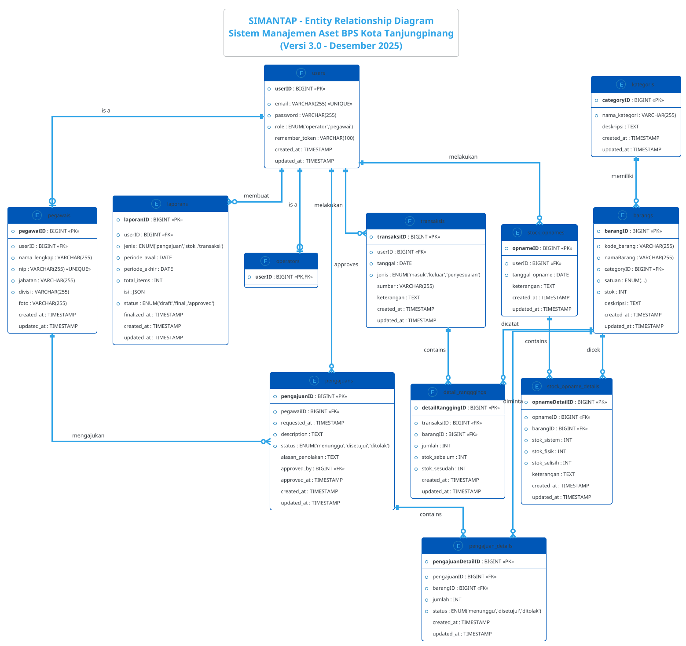

# 📊 Dokumentasi Database SIMANTAP
## Sistem Manajemen Aset dan Barang Milik Negara - BPS Kota Tanjungpinang

**Versi**: 3.0 (Terbaru - Desember 2025)  
**Terakhir Diperbarui**: 5 Desember 2025

---

## 📋 Daftar Tabel Database

| No | Nama Tabel | Deskripsi | Jumlah Kolom |
|----|------------|-----------|--------------|
| 1 | `users` | Autentikasi pengguna (operator/pegawai) | 6 |
| 2 | `operators` | Data operator sistem | 1 |
| 3 | `pegawais` | Data pegawai BPS | 8 |
| 4 | `kategoris` | Kategori barang | 4 |
| 5 | `barangs` | Data barang inventaris | 8 |
| 6 | `pengajuans` | Header permintaan barang | 9 |
| 7 | `pengajuan_details` | Detail item permintaan | 6 |
| 8 | `transaksis` | Header transaksi stok | 7 |
| 9 | `detail_rangggings` | Detail item transaksi | 7 |
| 10 | `stock_opnames` | Header stock opname | 5 |
| 11 | `stock_opname_details` | Detail item stock opname | 7 |
| 12 | `laporans` | Laporan sistem | 10 |
| 13 | `sessions` | Session Laravel | 5 |

---

## 🔷 Struktur Tabel Lengkap

### 1. Tabel `users`
```
+------------------+----------------------------------+------+-----+
| Kolom            | Tipe                             | Null | Key |
+------------------+----------------------------------+------+-----+
| userID           | BIGINT UNSIGNED AUTO_INCREMENT   | NO   | PK  |
| email            | VARCHAR(255) UNIQUE              | NO   |     |
| password         | VARCHAR(255)                     | NO   |     |
| role             | ENUM('operator','pegawai')       | NO   |     |
| remember_token   | VARCHAR(100)                     | YES  |     |
| created_at       | TIMESTAMP                        | YES  |     |
| updated_at       | TIMESTAMP                        | YES  |     |
+------------------+----------------------------------+------+-----+
```

### 2. Tabel `operators`
```
+--------+----------------------------------+------+-----+
| Kolom  | Tipe                             | Null | Key |
+--------+----------------------------------+------+-----+
| userID | BIGINT UNSIGNED                  | NO   | PK,FK |
+--------+----------------------------------+------+-----+
FK: userID → users.userID (ON DELETE CASCADE)
```

### 3. Tabel `pegawais`
```
+---------------+----------------------------------+------+-----+
| Kolom         | Tipe                             | Null | Key |
+---------------+----------------------------------+------+-----+
| pegawaiID     | BIGINT UNSIGNED AUTO_INCREMENT   | NO   | PK  |
| userID        | BIGINT UNSIGNED                  | NO   | FK  |
| nama_lengkap  | VARCHAR(255)                     | NO   |     |
| nip           | VARCHAR(255) UNIQUE              | NO   |     |
| jabatan       | VARCHAR(255)                     | NO   |     |
| divisi        | VARCHAR(255)                     | NO   |     |
| foto          | VARCHAR(255)                     | YES  |     |
| created_at    | TIMESTAMP                        | YES  |     |
| updated_at    | TIMESTAMP                        | YES  |     |
+---------------+----------------------------------+------+-----+
FK: userID → users.userID (ON DELETE CASCADE)
```

### 4. Tabel `kategoris`
```
+---------------+----------------------------------+------+-----+
| Kolom         | Tipe                             | Null | Key |
+---------------+----------------------------------+------+-----+
| categoryID    | BIGINT UNSIGNED AUTO_INCREMENT   | NO   | PK  |
| nama_kategori | VARCHAR(255)                     | NO   |     |
| deskripsi     | TEXT                             | YES  |     |
| created_at    | TIMESTAMP                        | YES  |     |
| updated_at    | TIMESTAMP                        | YES  |     |
+---------------+----------------------------------+------+-----+
```

### 5. Tabel `barangs`
```
+---------------+------------------------------------------------+------+-----+
| Kolom         | Tipe                                           | Null | Key |
+---------------+------------------------------------------------+------+-----+
| barangID      | BIGINT UNSIGNED AUTO_INCREMENT                 | NO   | PK  |
| kode_barang   | VARCHAR(255)                                   | NO   |     |
| namaBarang    | VARCHAR(255)                                   | NO   |     |
| categoryID    | BIGINT UNSIGNED                                | NO   | FK  |
| satuan        | ENUM('rim','pcs','buah','box','pack',          | NO   |     |
|               |      'set','lembar','meter','kg','liter')      |      |     |
| stok          | INT DEFAULT 0                                  | NO   |     |
| deskripsi     | TEXT                                           | YES  |     |
| created_at    | TIMESTAMP                                      | YES  |     |
| updated_at    | TIMESTAMP                                      | YES  |     |
+---------------+------------------------------------------------+------+-----+
FK: categoryID → kategoris.categoryID (ON DELETE RESTRICT)
```

### 6. Tabel `pengajuans`
```
+------------------+---------------------------------------------+------+-----+
| Kolom            | Tipe                                        | Null | Key |
+------------------+---------------------------------------------+------+-----+
| pengajuanID      | BIGINT UNSIGNED AUTO_INCREMENT              | NO   | PK  |
| pegawaiID        | BIGINT UNSIGNED                             | NO   | FK  |
| requested_at     | TIMESTAMP                                   | NO   |     |
| description      | TEXT                                        | NO   |     |
| status           | ENUM('menunggu','disetujui','ditolak')      | NO   |     |
| alasan_penolakan | TEXT                                        | YES  |     |
| approved_by      | BIGINT UNSIGNED                             | YES  | FK  |
| approved_at      | TIMESTAMP                                   | YES  |     |
| created_at       | TIMESTAMP                                   | YES  |     |
| updated_at       | TIMESTAMP                                   | YES  |     |
+------------------+---------------------------------------------+------+-----+
FK: pegawaiID → pegawais.pegawaiID (ON DELETE CASCADE)
FK: approved_by → users.userID (ON DELETE SET NULL)
```

### 7. Tabel `pengajuan_details`
```
+-------------------+---------------------------------------------+------+-----+
| Kolom             | Tipe                                        | Null | Key |
+-------------------+---------------------------------------------+------+-----+
| pengajuanDetailID | BIGINT UNSIGNED AUTO_INCREMENT              | NO   | PK  |
| pengajuanID       | BIGINT UNSIGNED                             | NO   | FK  |
| barangID          | BIGINT UNSIGNED                             | NO   | FK  |
| jumlah            | INT                                         | NO   |     |
| status            | ENUM('menunggu','disetujui','ditolak')      | NO   |     |
| created_at        | TIMESTAMP                                   | YES  |     |
| updated_at        | TIMESTAMP                                   | YES  |     |
+-------------------+---------------------------------------------+------+-----+
FK: pengajuanID → pengajuans.pengajuanID (ON DELETE CASCADE)
FK: barangID → barangs.barangID (ON DELETE RESTRICT)
```

### 8. Tabel `transaksis`
```
+-------------+---------------------------------------------+------+-----+
| Kolom       | Tipe                                        | Null | Key |
+-------------+---------------------------------------------+------+-----+
| transaksiID | BIGINT UNSIGNED AUTO_INCREMENT              | NO   | PK  |
| userID      | BIGINT UNSIGNED                             | NO   | FK  |
| tanggal     | DATE                                        | NO   | IDX |
| jenis       | ENUM('masuk','keluar','penyesuaian')        | NO   | IDX |
| sumber      | VARCHAR(255)                                | YES  |     |
| keterangan  | TEXT                                        | YES  |     |
| created_at  | TIMESTAMP                                   | YES  |     |
| updated_at  | TIMESTAMP                                   | YES  |     |
+-------------+---------------------------------------------+------+-----+
FK: userID → users.userID (ON DELETE RESTRICT)
```

### 9. Tabel `detail_rangggings`
```
+-----------------+----------------------------------+------+-----+
| Kolom           | Tipe                             | Null | Key |
+-----------------+----------------------------------+------+-----+
| detailRanggingID| BIGINT UNSIGNED AUTO_INCREMENT   | NO   | PK  |
| transaksiID     | BIGINT UNSIGNED                  | NO   | FK  |
| barangID        | BIGINT UNSIGNED                  | NO   | FK  |
| jumlah          | INT                              | NO   |     |
| stok_sebelum    | INT                              | NO   |     |
| stok_sesudah    | INT                              | NO   |     |
| created_at      | TIMESTAMP                        | YES  |     |
| updated_at      | TIMESTAMP                        | YES  |     |
+-----------------+----------------------------------+------+-----+
FK: transaksiID → transaksis.transaksiID (ON DELETE CASCADE)
FK: barangID → barangs.barangID (ON DELETE RESTRICT)
```

### 10. Tabel `stock_opnames`
```
+----------------+----------------------------------+------+-----+
| Kolom          | Tipe                             | Null | Key |
+----------------+----------------------------------+------+-----+
| opnameID       | BIGINT UNSIGNED AUTO_INCREMENT   | NO   | PK  |
| userID         | BIGINT UNSIGNED                  | NO   | FK  |
| tanggal_opname | DATE                             | NO   | IDX |
| keterangan     | TEXT                             | YES  |     |
| created_at     | TIMESTAMP                        | YES  |     |
| updated_at     | TIMESTAMP                        | YES  |     |
+----------------+----------------------------------+------+-----+
FK: userID → users.userID (ON DELETE RESTRICT)
```

### 11. Tabel `stock_opname_details`
```
+----------------+----------------------------------+------+-----+
| Kolom          | Tipe                             | Null | Key |
+----------------+----------------------------------+------+-----+
| opnameDetailID | BIGINT UNSIGNED AUTO_INCREMENT   | NO   | PK  |
| opnameID       | BIGINT UNSIGNED                  | NO   | FK  |
| barangID       | BIGINT UNSIGNED                  | NO   | FK  |
| stok_sistem    | INT                              | NO   |     |
| stok_fisik     | INT                              | NO   |     |
| stok_selisih   | INT                              | NO   |     |
| keterangan     | TEXT                             | YES  |     |
| created_at     | TIMESTAMP                        | YES  |     |
| updated_at     | TIMESTAMP                        | YES  |     |
+----------------+----------------------------------+------+-----+
FK: opnameID → stock_opnames.opnameID (ON DELETE CASCADE)
FK: barangID → barangs.barangID (ON DELETE RESTRICT)
```

### 12. Tabel `laporans`
```
+---------------+---------------------------------------------+------+-----+
| Kolom         | Tipe                                        | Null | Key |
+---------------+---------------------------------------------+------+-----+
| laporanID     | BIGINT UNSIGNED AUTO_INCREMENT              | NO   | PK  |
| userID        | BIGINT UNSIGNED                             | NO   | FK  |
| jenis         | ENUM('pengajuan','stok','transaksi')        | NO   | IDX |
| periode_awal  | DATE                                        | NO   | IDX |
| periode_akhir | DATE                                        | NO   |     |
| total_items   | INT DEFAULT 0                               | NO   |     |
| isi           | JSON                                        | YES  |     |
| status        | ENUM('draft','final','approved')            | NO   | IDX |
| finalized_at  | TIMESTAMP                                   | YES  |     |
| created_at    | TIMESTAMP                                   | YES  |     |
| updated_at    | TIMESTAMP                                   | YES  |     |
+---------------+---------------------------------------------+------+-----+
FK: userID → users.userID (ON DELETE RESTRICT)
```

---

## 🌐 Kode PlantUML ERD



---

## 📊 Data Seeder (Default)

### Users & Roles
| Email | Role | Password |
|-------|------|----------|
| operator1@bps.go.id | operator | password |
| operator2@bps.go.id | operator | password |
| nabhan@bps.go.id | pegawai | password |
| faruq@bps.go.id | pegawai | password |
| danang@bps.go.id | pegawai | password |
| difya@bps.go.id | pegawai | password |
| aulia@bps.go.id | pegawai | password |
| evelyn@bps.go.id | pegawai | password |
| indri@bps.go.id | pegawai | password |
| bambang@bps.go.id | pegawai | password |
| siti@bps.go.id | pegawai | password |
| rudi@bps.go.id | pegawai | password |

### Kategori
| Nama | Deskripsi |
|------|-----------|
| ATK | Alat Tulis Kantor |
| Elektronik | Perangkat Elektronik |
| Cetakan | Barang Cetakan |
| Lain-lain | Barang Lain-lain |

### Barang (18 items)
- **ATK**: Kertas HVS, Bolpoint, Pensil, Spidol, Stapler, Kertas Karbon, Tinta Printer, Map Folio
- **Elektronik**: Lampu LED, Kabel LAN, Keyboard Wireless, Mouse Optic
- **Cetakan**: Formulir Pengajuan, Label Stiker, Undangan Acara
- **Lain-lain**: Air Mineral Galon, Kopi Instant, Gula Pasir

---

## 🔄 Relasi Antar Tabel

```
users (1) ─────────┬──────── (1) operators
                   │
                   ├──────── (1) pegawais ──── (M) pengajuans
                   │                                   │
                   ├──────── (M) transaksis            ├── (M) pengajuan_details
                   │              │                    │           │
                   │              └── (M) detail_rangggings        │
                   │                          │                    │
                   ├──────── (M) stock_opnames─┼─ (M) stock_opname_details
                   │                           │           │
                   └──────── (M) laporans      │           │
                                               ▼           ▼
                                        kategoris (1) ──── (M) barangs
```

---

## 📝 Catatan Penting

1. **Kolom `foto` pada `pegawais`**: Ditambahkan untuk menyimpan path foto profil pegawai
2. **Tabel `operators`**: Hanya berisi FK ke users (operator = sistem, bukan personal)
3. **Kolom `stok` pada `barangs`**: Simplified - hanya satu kolom stok (dihitung real-time)
4. **Status pada `pengajuan_details`**: Untuk tracking status per item (bukan hanya per pengajuan)
5. **Kolom `jenis` pada `transaksis`**: masuk/keluar/penyesuaian untuk fleksibilitas
6. **Auto-generated `kode_barang`**: Format BRG-001, BRG-002, dll (via Model booted hook)

---

**Dibuat oleh**: SIMANTAP Development Team  
**Untuk**: BPS Kota Tanjungpinang
